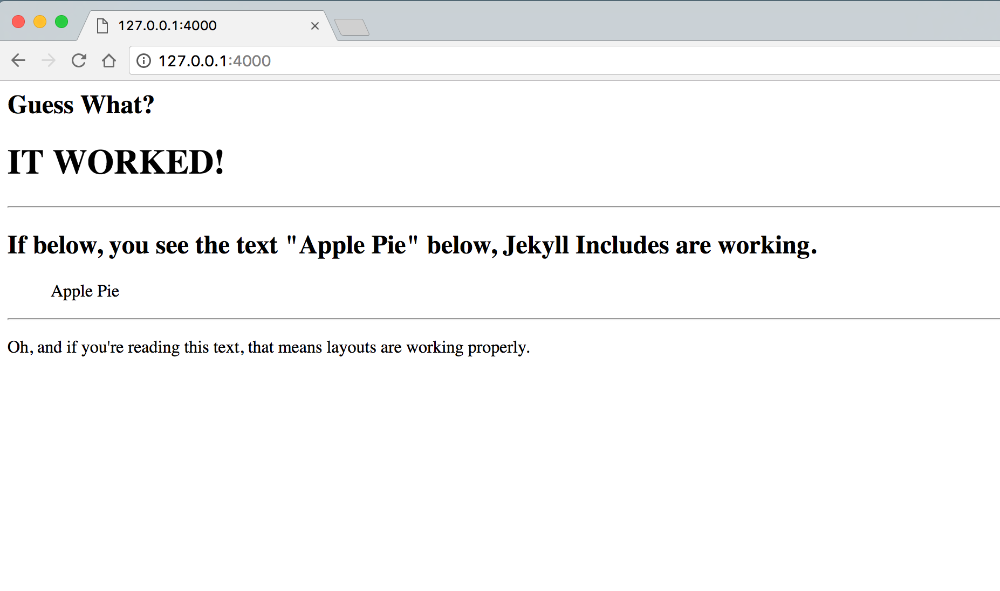

# This is a basic example for testing Jekyll-Pug

## Installation:

**Step 1**: Clone the repo and change into the directory using these commands:

```
git clone https://github.com/DougBeney/jekyll-pug-test.git
cd jekyll-pug-test
```

**Step 2**: Install the proper packages using this command:

```
bundle install
```

**Step 3**: Start the Jekyll server and view the site.

```
jekyll serve
```

##Results

If all went accordingly, you should see the following on `http://localhost:4000`



If you only see "Guess What? IT WORKED", but not the bottom text, beginning with "oh", that means layouts aren't working properly.

[Please submit any problems here.](https://github.com/DougBeney/jekyll-pug/issues)
